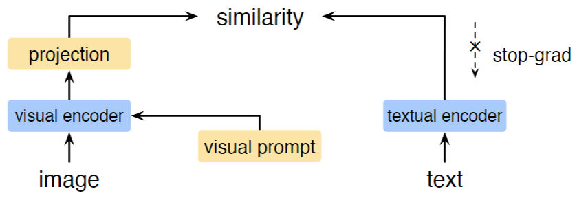

# [Code] CITE

<!-- select Model and/or Data and/or Code as needed -->
### Welcome to OpenMEDLab! 👋

<!--
**Here are some ideas to get you started:**
🙋‍♀️ A short introduction - what is your organization all about?
🌈 Contribution guidelines - how can the community get involved?
👩‍💻 Useful resources - where can the community find your docs? Is there anything else the community should know?
🍿 Fun facts - what does your team eat for breakfast?
🧙 Remember, you can do mighty things with the power of [Markdown](https://docs.github.com/github/writing-on-github/getting-started-with-writing-and-formatting-on-github/basic-writing-and-formatting-syntax)
-->


<!-- Insert the project banner here 
<div align="center">
    <a href="https://"></a>
</div>
-->

---

<!-- Select some of the point info, feel free to delete -->
<!--
[](https://twitter.com/opendilab)
[](https://pypi.org/project/DI-engine/)


[](https://codecov.io/gh/opendilab/DI-engine)


[](https://github.com/opendilab/DI-engine/stargazers)
[](https://github.com/opendilab/DI-engine/network)

[](https://github.com/opendilab/DI-engine/issues)
[](https://github.com/opendilab/DI-engine/pulls)
[](https://github.com/opendilab/DI-engine/graphs/contributors)
[](https://github.com/opendilab/DI-engine/blob/master/LICENSE)
-->

Updated on 2023.06.08


## Key Features

This repository provides the official implementation of *Text-guided Foundation Model Adaptation for Pathological Image Classification*.

- 1 Low computational cost
- 2 Data-efficient
- 3 Compatible with various foundation models


## Links

- [Paper](https://)
- [Code](https://github.com/Yunkun-Zhang/CITE)
<!-- [Code] may link to your project at your institute -->


<!-- give a introduction of your project -->
## Details

The recent surge of foundation models in computer vision and natural language processing opens up perspectives in utilizing multi-modal clinical data to train large models with strong generalizability.
Yet pathological image datasets often lack biomedical text annotation and enrichment.
Guiding data-efficient image diagnosis from the use of biomedical text knowledge becomes a substantial interest.
In this paper, we propose to **C**onnect **I**mage and **T**ext **E**mbeddings (CITE) to enhance pathological image classification.
CITE injects text insights gained from language models pre-trained with a broad range of biomedical texts, leading to adapt foundation models towards pathological image understanding.
Through extensive experiments on the PatchGastric stomach tumor pathological image dataset, we demonstrate that  CITE achieves leading performance compared with various baselines especially when training data is scarce. CITE offers insights into leveraging in-domain text knowledge to reinforce data-efficient pathological image classification.

An overview of CITE:
<!-- Insert a pipeline of your algorithm here if got one -->
<div align="center">
    <a href="https://"></a>
</div>


## Dataset

Prepare the PatchGastric dataset:

1. Download `captions.csv` and `patches_captions.zip` from [PatchGastricADC22](https://zenodo.org/record/6550925).
2. Put them in `data/` and unzip the file.

## Get Started

**Main Requirements**  
> torch==1.13.0  
> mmcls==0.25.0  
> transformers  
> clip   


**Installation**
```bash
conda create -n CITE python=3.9
conda activate CITE
conda install pytorch==1.13.0 torchvision==0.14.0 torchaudio==0.13.0 pytorch-cuda=11.7 -c pytorch -c nvidia
pip install openmim
mim install mmcls==0.25.0
pip install -r requirements.txt
```


**Preprocess**

To follow our split of the dataset, please generate the annotation files by running:
```bash
python tools/ann.py
```

Or you can generate your own split following mmcls format:
```text
filename label
```


**Training**

The config files follow [mmcls](https://github.com/open-mmlab/mmclassification) style.
```bash
PYTHONPATH=.:$PYTHONPATH mim train <config>
```


**Testing**
```bash
PYTHONPATH=.:$PYTHONPATH mim test <config> --checkpoint <checkpoint> --metrics <metrics>
```

## 🙋‍♀️ Feedback and Contact

- [Email](mailto:ykzhang@sjtu.edu.cn)

<!--
## 🛡️ License

This project is under the CC-BY-NC 4.0 license. See [LICENSE](LICENSE) for details.
-->

<!--
## 🙏 Acknowledgement

A lot of code is modified from [monai](https://github.com/Project-MONAI/MONAI).
-->

## 📝 Citation

TO BE ADDED.

<!--
If you find this repository useful, please consider citing this paper:
```
@article{John2023,
  title={paper},
  author={John},
  journal={arXiv preprint arXiv:},
  year={2023}
}
```
-->
